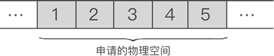

# 线性表

线性表是一组具有线性关系的数据结构，它的每个元素一般都有一个前驱元素和一个后继元素(除了收尾)。这里我们先介绍最简单
顺序线性表，一般最简单的线性表，我们称之为顺序线性表。格式如下表所示。

> 1 -> 2 -> 3 -> 4 -> 5 

上面就是一个线性表，如果使用顺序线性表表示表示。<font color="green">顺序表存储数据时，会提前申请一整块足够大小的物理空间，然后将数据依次存储起来，存储时做到数据元素之间不留一丝缝隙。</font>
顺序表表示上面的数据格式如下：



上图我们可以得出，将“具有 '一对一' 逻辑关系的数据按照次序连续存储到一整块物理空间上”的存储结构就是顺序存储结构。

这种顺序线性表，在每个编程语言中都存在，一般情况下就是我们所说的数组，以C++为例。

```
int a[5]; // 表示申请5分存储空间的顺序线性表
```

因为线性表使用之前要申请一个连续空间出来，比如申请的空间最多能存储N个整数，则存储的数字个数大于N的时候，就要进行扩充和移动，C++ STL中为了更好的扩展这种功能，提供一个vector数据结构，这就是一个自动扩充的线性表，支持数据结果的初始化、增删改查、替换，返回长度等操作。接下我们就自己写个vector的线性表，都支持各种操作，我们底层使用最简单的数组作为初级数据结果。（会用到C++命名空间和模板编程，大家可以自行查阅百度）

定义一个class，我们需要有增删改查查的函数，还需要有表示到当前数组的长度属性。

基本操作编辑
1. MakeEmpty(L) 这是一个将L变为空表的方法
2. Length（L） 返回表L的长度，即表中元素个数
3. Get（L，i） 这是一个函数，函数值为L中位置i处的元素（1≤i≤n）
4. Prior（L，i） 取i的前驱元素
5. Next（L，i） 取i的后继元素
6. Locate（L，x） 这是一个函数，函数值为元素x在L中的位置
7. Insert（L，i，x）在表L的位置i处插入元素x，将原占据位置i的元素及后面的元素都向后推一个位置
8. Delete（L，p） 从表L中删除位置p处的元素
9. IsEmpty(L) 如果表L为空表(长度为0)则返回true，否则返回false
10. Clear（L）清除所有元素
11. Init（L）同第一个，初始化线性表为空
12. Traverse（L）遍历输出所有元素
13. Find（L，x）查找并返回元素
14. Update（L，x）修改元素


## Ref
1. http://c.biancheng.net/view/3334.html
2. https://baike.baidu.com/item/%E7%BA%BF%E6%80%A7%E8%A1%A8/3228081?fr=aladdin