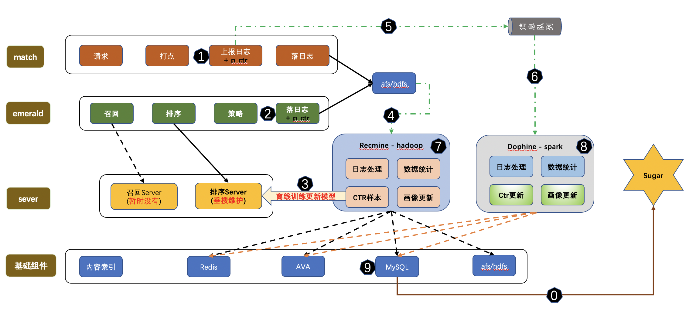

爱采购模型训练和迭代

架构图
<centor></centor>

CTR模型训练&验证

+ 准备训练数据，架构图中的4和3
   1. 图中的4：对应日志的merge，样本的拼接和特征选择
   2. 图中的3：使用离线训练脚本，天级别更新训练LR模型，
   3. 建议使用20天的数据进行训练，训练模式支持增量模型delat，这个可以咨询垂搜同学【国梁】
   4. 测试机使用最近2天的数据进行测试auc，这个可以在配置中配置
   5. 建议计算下不同维度下的auc，例如计算每个类目下的auc，这个也是可以配置的，建议咨询国梁
   6. 目前训练好的模型，需要手动更新，直接替换模型，测试，应该不会重启服务
   7. 为了得到更好的model，建议对不同的位置训练不同的模型，例如首页推荐和详情页底部各一个model。
   8. 训练样本，暂时不用进行采样，因为数据比较少，可以全量训练，
   9. 样本的拼接，目前样本的拼接是存在部分样本没有被用户看到，也存在部分问题
   10. 如何使用增量数据，需要小时级别，完成样本的生成，让模型自动更新；如果使用此模式，需要推送模型的方式，目前是手动，可以该改成小时级自动
   11. 特征方向，建议使用尽可能多的类目特征，数据特征的统计可以通过bigpipe，使用sparking 近实时的写入到redis，在线选择
   12. 特征使用的时候，目前所有的特征来自最后正排信息，建议初期先存在到ava吧，还是在线自己组pb进行请求，
+ 图中5：match下发数据到bigpipe，
+ 图中1：match下发的数据新增p_ctr，并且写入日志
+ 图中2：emerald的数据新增p_ctr，写入日志
+ 图中4：主要是日志merge和ctr训练样本生成
+ 图中3：表示训练模型，推送新模型，可以改成增量，自动推送模型
+ 图中6：表示日志的流式处理，可以比小时级日志处理更快速的更新模型
+ 图中8：表示spark处理日志，这里可以使用实时的match下发的数据，计算小时级的auc
+ 图中7：在原来的数据统计的基础上，新增p_ctr，可以根据点击数据计算auc，可以计算不同类目，不同商品，等多维度的auc。计算方式很简单，得到(p_tr, label), 使用sklearn中的公式即可
+ 图中9：和现在的逻辑一直，将计算得到的auc，写入到mysql
+ 图中0：sugar连接mysql进行报表显示

注：上述有两种在线计算auc的方式，第一种使用现有小时级日志统计，新增p_ctr，直接计算接口
第二种，使用match下发数据，在spark层进行计算

机器村落

晚十点，拾点算法。数据结构和算法
1. 综述
2. 线性表
3. 数组
4. 队列

